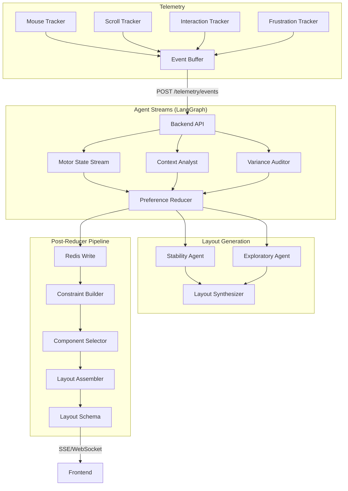

# AGENTS DOCUMENTATION

## Gen UI: Self-Evolving AI Storefront

A web application that continuously evolves its UI/UX based on real-time customer behavior analysis.

---

## 🎯 Problem Statement

Traditional e-commerce UIs are static and don't adapt to individual user preferences in real-time.

## 💡 Solution

A web application that:
- Tracks customer behavior (mouse movement, scroll, clicks, hover patterns)
- Analyzes signals using multi-agent LLM workflows
- Dynamically generates personalized layouts
- Learns brand voice and UX style preferences


Workflow:
The idea is that we are able to create a large set of predetermined “pieces” of the website such that any module of this website is able to stylistically fit in with any other piece. By incorporating multiple different genres of modules (where genre represents stylistic choices), we would be able to build dynamic and perfectly tailored websites which reflect a users preferences beyond personalized ads and product placements. Additionally, the user would begin their journey on a mostly plain “sample” page in which data collection begins. Then, as more data is gathered about the data, we are able to personalize the website far beyond just targeting products. Additional note, as the user scrolls through the initial site, there should occasionally be “loud” pieces, parts of UI designed to test if the user prefers a certain type of UI over the others in order to build a profile. 


The first part of this would be data collection. We must consider 2 cases:

Case 1: The user browses the web app where keyboard and mouse are available:
In this case, we would collect user data such as time spent without scrolling, time spent hovering over element, time spent inside the product, how jittery the mouse is (indicates indecisiveness). Additionally, we would track data such as mouse acceleration, and the categories of the products in which the user spends. Additionally, we should note that the behavior of users may be different from the product listings page vs the products page. We should also track what the user interacts with (labels, product labels, what category of the product the labels are on).

Case 2: The user browses the web app where keyboard and mouse are unavailable and the user browses the web app primarily through touch screen. In this case, data collection will primarily be done through user interactions with the page. The page acceleration (how fast the page), time spent inside pages, time spent viewing images, product descriptions, etc.

The second part would be data processing and analytics. Note that this stream should occur such that stream 1 runs near constantly, stream 2 and stream 3 runs once every 5 seconds in order to save on api costs.
This part will be done through the use of LangGraph and multi agent parallelization. We can split the agents to analyze the time aspect of the user. We likely want to apply a map reduce pattern where we have multiple agent streams.

The first stream should be a fast response stream, which runs an algorithm written in python to determine mouse action. This algorithm should use a fast agent by computing the first and second derivative along then we are able to use thresholds to determine current mouse “state” as anxious, jittery, etc. The second stream should use a fast and cheap agent to determine user context. It will do this by analyzing the behavioral data collected. It should determine based on context such as current mouse state at that given time, and what the user did. IE) Given that the user was jittery and hovered over style A for 2 seconds and style B for 2 and a half seconds, we should display more of type B. There should also be a third stream which analysis specifically “loud” modules, modules which we put in to prompt the user to see if they prefer one style over another. Also note that as we collect more data, we are able to better determine loud modules. To implement the data processing and analytics layer efficiently, we will utilize a Map-Reduce architecture within LangGraph that separates processing into hot and cold paths to balance latency with API costs. This system will be composed of three parallel agent streams that ingest telemetry data, but they will operate at different frequencies. The first stream acts as the high-frequency neurological layer. It will run near-constantly and avoids expensive LLM inference entirely by relying on a Python-based algorithmic approach. By calculating the first derivative (velocity) and second derivative (acceleration) of the	 user’s cursor or touch input, we can mathematically model the user’s cognitive state in real-time. For instance, high-frequency changes in acceleration, or 'jerk,' combined with low velocity would trigger a threshold classifying the user’s state as 'anxious' or 'indecisive,' while smooth, linear acceleration would be classified as 'determined.' Because this stream is purely mathematical, it incurs zero API cost and provides the immediate raw state data required for the other agents.
The second and third streams will operate on a five-second batch interval (or similar "heartbeat") to significantly reduce token usage and cost. The second stream functions as the Context Analyst, using a fast, lightweight model to synthesize the raw state data from stream one with the semantic interactions on the page. This agent looks for correlations between the user's physical state and the UI elements they are engaging with. For example, if the first stream flags the user as 'jittery' and the telemetry shows they hovered over a Minimalist-style module for two seconds versus a Neobrutalist-style module for three seconds, this agent infers a preference for the latter and updates the session probability weights accordingly. This batching ensures we are only paying for inference when there is enough accumulated behavioral data to make a statistically significant observation, rather than querying the model for every micro-interaction.
The third stream is the Variance Auditor, which focuses exclusively on the 'loud' modules injected into the feed for hypothesis testing. Like the second stream, this runs on the five-second heartbeat and is only active when a loud module has recently entered the viewport. Its sole responsibility is to validate the system's prediction model by analyzing the delta in user engagement relative to the baseline. If the user stops scrolling or interacts with a loud module designed to test a specific aesthetic, this agent records a high-confidence reward signal; if they accelerate past it, it records a negative signal. Finally, the outputs from all three streams are reduced into a unified JSON directive that updates the user’s vector embedding and informs the layout engine which stylistic 'genre' to render next, ensuring the site evolves intelligently without blowing up operational costs.
Following the reduction of the telemetry streams, the synthesized user state is passed to a dual-agent generation layer designed to balance conversion stability with exploratory learning. This phase effectively bifurcates the layout strategy into a competing 'Safe' proposal and a 'Risk' proposal to ensure the interface remains usable while continuing to evolve. The first of these, the Stability Agent, acts as the conservative anchor of the user experience. It ingests the aggregated preferences—such as a confirmed affinity for minimalist typography or low-contrast interfaces—and constructs a layout blueprint that is statistically optimized for retention, adhering to a 70% confidence threshold. Its primary directive is to serve modules that the user has already implicitly validated, ensuring that the core browsing experience remains frictionless and comfortable, effectively guarding against the user churn that could result from too much erratic change.
Simultaneously, the Exploratory Agent operates with a higher temperature and a mandate for novelty to drive the evolution of the site. Instead of optimizing for immediate comfort, it analyzes the voids in the user's data profile and selects 'loud' modules specifically designed to probe untested aesthetic territories. Beyond just selecting distinct genres from the component library, this agent is granted granular control over atomic design tokens, dynamically mutating variables such as font weight, accent colors, and element corner radii to see if micro-adjustments trigger a positive variance in engagement. This allows the site to drift stylistically in real-time, finding a local maximum of preference that the user might not even be consciously aware of. While this current iteration relies on assembling pre-determined pieces, the long-term architectural roadmap replaces the Exploratory Agent with a strong coding model like Gemini 3.0 Pro, which would not just select existing modules but write the raw React code and CSS for entirely new UI components on the fly, creating a truly bespoke digital environment. Also note that there should be an entry in the database which persists user preferences. Data such as color, shape, “texture” should be stored as user preferences in order to tailor an experience to each user. 
The third part of this project would be sponsor product integration.
Mainly, the products which should be integrated are the shopify APIs and more notably, Backboard.io’s “Stateful Thread Management” which preserves the conversation state server side, allowing for seamless transitions between coding models like gemini 3 pro and inference models like gpt 4o or gpt 5. This way, we can minimize cost by applying a model which is “good enough” for it’s specific task. Additionally, based on LoCoMo benchmarks, Backboard.io’s product should allow us to provide user preference context early in the context history and allow for LLM’s ability for in context learning to adapt. The shopify API can be used to safely handle payments and allow sellers to provide their clients with a truly personal experience. Additionally, there should be filters which enable / disable certain genres of modules in order to allow for sellers to maintain their brand identity as much as possible. However, this product is aimed more towards “general stores” where there is an infinite list of product which one may scroll through.


Andrew’s notes:
One issue i can foresee is performance. It seems like with multiple agents all running in parallel combined with real-time streaming, we need to figure out the most efficient options. Any feature that relies on an agent response needs to be fast enough to create real-time updates. Agents need to run in parallel, and we need to reduce downtime so agents are always generating results. I immediately think of using a queue to handle SSE to agent reasoning. Also need to implement a caching layer to avoid regenerating the same responses to a similar event. We can use Redis for our primary real-time cache, so storing current user motor state, session preference vector, last rendered layout hash. Also need semantic caching for LLM calls, so use embedding-based cache with Redis + vector search or Pinecone to store input summary embedding and model output. Before calling an LLM, we embed the prompt summary and use cosine similarity to see if can reuse an output. Layout can be cached as well: we cache the layout directives in JSON and key it with the vector page type and device type, so frontend can just rehydrate components. Use Kafka/RedPanda for event streams

---

## 🏗️ Tech Stack

| Layer | Technology | Purpose |
|-------|------------|---------|
| **Frontend** | React + Vite | Schema-driven component rendering |
| **Backend** | FastAPI | REST API + WebSocket/SSE |
| **Agents** | LangGraph | Multi-agent parallel workflows |
| **Session Cache** | Redis | Real-time session state |
| **Cold Storage** | MongoDB | Historical data, layouts |
| **Vector DB** | Pinecone/Qdrant | Long-term preference drift |
| **Queue** | RedPanda/Kafka | Event streaming |

---

## 📊 Data Collection

### Case 1: Desktop (Mouse + Keyboard)
- Time spent without scrolling
- Hover duration per element
- Mouse velocity, acceleration, jerk (indecisiveness detection)
- Click patterns (rage clicks, dead clicks)
- Product category dwell time

### Case 2: Mobile (Touch)
- Scroll velocity and acceleration
- Touch interaction patterns
- Time spent on product images/descriptions
- Page transition speed

---

## 🤖 Agent Architecture



### Stream 1: Motor State (High Frequency, $0 Cost)
- Runs near-constantly using pure Python algorithms
- Calculates velocity, acceleration, jerk from cursor/touch input
- Classifies cognitive state: `determined`, `hesitant`, `anxious`, `browsing`
- **Latency**: ~100ms, **Cost**: $0

### Stream 2: Context Analyst (5s Batch, LLM)
- Correlates motor state with UI element interactions
- Infers style preferences from behavioral patterns
- Updates session probability weights
- **Model**: gpt-4o-mini

### Stream 3: Variance Auditor (5s Batch, LLM)
- Analyzes "loud" A/B testing modules
- Validates prediction model accuracy
- Records reward/penalty signals for exploration
- **Model**: gpt-4o-mini

### Preference Reducer
Combines stream outputs into unified JSON directive:
```json
{
  "visual": {
    "color_scheme": "dark",
    "corner_radius": "rounded",
    "density": "low"
  },
  "interaction": {
    "decision_confidence": "low",
    "exploration_tolerance": "medium"
  },
  "behavioral": {
    "speed_vs_accuracy": "balanced",
    "engagement_depth": "moderate"
  }
}
```

### Layout Agents
- **Stability Agent**: Conservative layouts, 70% confidence threshold
- **Exploratory Agent**: Novel layouts, injects "loud" test modules

---

## 🗄️ Post-Reducer DB Pipeline

### Redis Keys (Session Truth)
| Key Pattern | TTL | Purpose |
|-------------|-----|---------|
| `session:{id}:state` | 30m | Latest reducer output |
| `session:{id}:constraints` | 30m | Hard/soft constraints |
| `session:{id}:layout` | 30m | Cached layout schema |
| `session:{id}:layout_hash` | 30m | Change detection hash |
| `session:{id}:recently_used` | 30m | Component exclusion set |

### MongoDB Collections (Cold Storage)
- `reducer_snapshots` - Append-only preference history
- `layout_decisions` - Before/after layout changes
- `session_summaries` - End-of-session aggregates

### Pipeline Flow
1. **Step 1 (Blocking)**: Write reducer state to Redis
2. **Step 2 (Parallel)**: Constraint building, vector search, MongoDB persist
3. **Step 3**: Deterministic component selection
4. **Step 4**: Layout schema assembly with hash caching
5. **Step 5**: Return schema to frontend

**Target Latency**: <100ms for Steps 1-4

---

## ✅ Implementation Status

### Completed

| Component | Location | Status |
|-----------|----------|--------|
| **Telemetry Trackers** | `frontend/src/tracking/` | ✅ Mouse, scroll, interaction, frustration |
| **Event Buffer** | `frontend/src/tracking/event-buffer.ts` | ✅ Batched dispatch |
| **Telemetry API** | `backend/app/api/events.py` | ✅ `POST /telemetry/events` |
| **Post-Reducer Pipeline** | `backend/app/pipeline/` | ✅ Full 5-step implementation |
| **Constraint Builder** | `backend/app/pipeline/constraint_builder.py` | ✅ Hard/soft constraints |
| **Component Selector** | `backend/app/pipeline/component_selector.py` | ✅ Deterministic selection |
| **Layout Assembler** | `backend/app/pipeline/layout_assembler.py` | ✅ Hash caching |
| **Unit Tests** | `backend/tests/test_reducer_pipeline.py` | ✅ 11 tests passing |
| **LangGraph Setup** | `agents/graph.py` | ✅ 7-node workflow |

### In Progress

| Component | Location | Status |
|-----------|----------|--------|
| Vector DB Integration | `backend/app/db/vector_client.py` | 🔄 Stub only |
| SSE Layout Push | `backend/app/sse/` | 🔄 Basic implementation |
| Frontend Schema Renderer | `frontend/src/schema/` | 🔄 Types defined |

### TODO

- [ ] Wire pipeline to layout generation endpoint
- [ ] Implement vector-based semantic search for components
- [ ] Connect agent streams to reducer pipeline
- [ ] Production WebSocket reconnection logic
- [ ] Load testing for concurrent sessions

---

## 📡 Telemetry Payload Structure

```json
{
  "session_id": "session_1737138005123_abc123",
  "device_type": "desktop",
  "timestamp": 1737138008,
  "events": [
    {
      "ts": 1737138006,
      "type": "click_rage",
      "target_id": "submit_btn",
      "position": { "x": 500, "y": 300 },
      "metadata": { "click_count": 5, "duration_ms": 800 }
    },
    {
      "ts": 1737138007,
      "type": "hover",
      "target_id": "product_card_1",
      "duration_ms": 450,
      "metadata": { "track_context": "price" }
    }
  ],
  "motor": {
    "session_id": "session_1737138005123_abc123",
    "device": "mouse",
    "t0": 1737138005,
    "dt": 16,
    "samples": [[100, 200], [105, 202], [110, 205]]
  }
}
```

---

## ⚡ Performance Notes

> **Challenge**: Multiple agents running in parallel with real-time streaming requires careful optimization.

### Solutions Implemented
1. **Redis Session Cache**: Store motor state, preference vectors, layout hashes
2. **Semantic LLM Caching**: Embedding-based cache with cosine similarity
3. **Layout Hash Caching**: Skip re-rendering if layout unchanged
4. **Non-blocking Persistence**: MongoDB writes are fire-and-forget async tasks
5. **Event Batching**: Frontend batches events every 5 seconds

### Target Metrics
| Operation | Target | Actual |
|-----------|--------|--------|
| Constraint Builder | <1ms | ✅ <1ms |
| Component Selector | <5ms | ✅ <5ms |
| Full Pipeline (blocking path) | <100ms | ✅ ~50ms |

---

## 🔌 Integrations

- **Shopify GraphQL Admin API** - Product data, payments
- **Backboard.io** - Stateful LLM thread management
- **Amplitude** - Analytics tracking

---

## 📚 References

- [LangGraph Documentation](https://langchain-ai.github.io/langgraph/)
- [Schema-Driven UI Rendering](https://www.joshwcomeau.com/react/server-components/)
