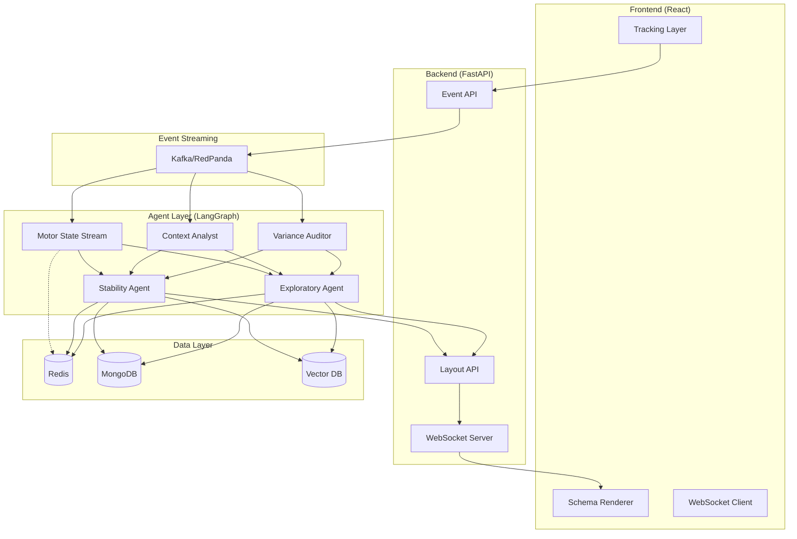

# System Architecture

This document describes the architecture of the Self-Evolving AI Storefront.

## Overview

## Data Flow

1. **Tracking** → Frontend collects mouse/touch telemetry
2. **Ingestion** → Events batched and sent to Event API
3. **Streaming** → Events published to Kafka/RedPanda
4. **Processing** → Three streams analyze telemetry in parallel
5. **Generation** → Stability + Exploratory agents produce layouts
6. **Delivery** → Layouts pushed via WebSocket/SSE
7. **Rendering** → Frontend renders schema-driven components

## Three-Stream Processing

| Stream | Frequency | Purpose | Cost |
|--------|-----------|---------|------|
| Motor State | ~100ms | Velocity/acceleration analysis | $0 |
| Context Analyst | 5s batch | Correlate state + UI interactions | Low |
| Variance Auditor | 5s batch | Evaluate "loud" module responses | Low |

## Caching Strategy

- **Redis**: Session state, motor state, layout hash
- **Semantic Cache**: Embedding-based LLM response cache
- **Layout Cache**: JSON directives by page + device type
