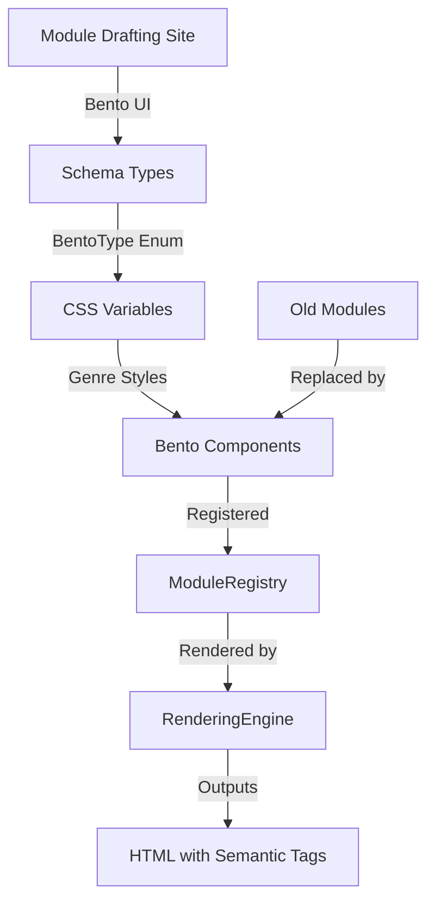

# Bento UI Integration Plan

## Overview
Integrate the bento-style UI elements from the module drafting site into the main frontend, replacing the old module components with new bento-based components.

## Current State Analysis

### Module Drafting Site (Source)
- **Bento Grid**: 4-column grid with 280px row height
- **Bento Types**:
  - `bento-hero`: 2x2 grid units
  - `bento-wide`: 2x1 grid units
  - `bento-tall`: 1x2 grid units
  - `bento-small`: 1x1 grid unit
- **Genres**: glassmorphism, brutalism, neumorphism, cyberpunk, minimalist, monoprint

### Current Frontend (Target)
- **Module ID System**: 6 genres × 6 layouts = 36 modules
- **Genres**: base, minimalist, neobrutalist, glassmorphism, loud, cyber
- **Layouts**: Standard, Compact, Featured, Gallery, Technical, Bold

## Implementation Tasks

### Phase 1: Schema Updates
1. Add `BentoType` enum to [`types.ts`](uofthacks-13/frontend/src/schema/types.ts):
   - `BENTO_HERO = 0`
   - `BENTO_WIDE = 1`
   - `BENTO_TALL = 2`
   - `BENTO_SMALL = 3`

2. Update genre definitions to match drafting site:
   - Map existing genres to drafting site genres
   - Add new genre CSS variables

3. Expand module ID system:
   - New formula: ID = (genre × 4 × 3) + (bentoType × 3) + variation
   - Total: 6 genres × 4 bento types × 3 variations = 72 modules

### Phase 2: CSS Integration
1. Add bento CSS variables to [`index.css`](uofthacks-13/frontend/src/index.css):
   - Grid configuration
   - Bento size classes
   - Genre-specific bento styles (from drafting site)

2. Create bento-specific CSS:
   - `.bento-grid` container
   - `.bento-{type}` sizing classes
   - Genre-specific overrides

### Phase 3: Component Updates
1. Create new bento layout components in [`layouts/`](uofthacks-13/frontend/src/components/modules/layouts/):
   - `BentoHero.tsx` - Large featured product
   - `BentoWide.tsx` - Wide horizontal layout
   - `BentoTall.tsx` - Tall vertical layout
   - `BentoSmall.tsx` - Compact grid item

2. Each component accepts:
   - `product: ProductData`
   - `genre: Genre`
   - `bentoType: BentoType`
   - `moduleId: string` (semantic ID)
   - `showDebug?: boolean`

### Phase 4: Registry & Rendering
1. Update [`ModuleRegistry.ts`](uofthacks-13/frontend/src/components/modules/ModuleRegistry.ts):
   - Add bento components
   - Update ID encoding/decoding
   - Include semantic tagging

2. Update [`RenderingEngine.tsx`](uofthacks-13/frontend/src/components/RenderingEngine.tsx):
   - Support bento grid layout
   - Dynamic grid positioning
   - Semantic module IDs
   - Data attributes for styling

### Phase 5: Semantic Tagging
1. Module IDs now include:
   - Genre name (e.g., "glassmorphism")
   - Bento type (e.g., "hero")
   - Unique instance ID (e.g., "001")
   - Example: `mod-glassmorphism-hero-001`

2. HTML attributes:
   - `data-module-id`
   - `data-genre`
   - `data-bento-type`
   - `data-semantic-name`

## Architecture Diagram

## File Changes Summary

| File | Change Type | Description |
|------|-------------|-------------|
| `schema/types.ts` | Modify | Add BentoType, update genres |
| `index.css` | Modify | Add bento grid & genre styles |
| `ModuleRegistry.ts` | Modify | Register bento components |
| `RenderingEngine.tsx` | Modify | Support bento rendering |
| `layouts/BentoHero.tsx` | New | Hero bento component |
| `layouts/BentoWide.tsx` | New | Wide bento component |
| `layouts/BentoTall.tsx` | New | Tall bento component |
| `layouts/BentoSmall.tsx` | New | Small bento component |
| `layouts/types.ts` | Modify | Add bento props |

## Acceptance Criteria
1. ✅ Bento grid renders correctly with 4 columns
2. ✅ All 4 bento sizes work (hero, wide, tall, small)
3. ✅ All 6 genres apply correct styling
4. ✅ Semantic module IDs are generated and rendered
5. ✅ Old modules are replaced with bento equivalents
6. ✅ Responsive breakpoints work correctly
7. ✅ Debug info shows correct module metadata
